# Docker Lab (1)

A set of five Docker exercises covering the container lifecycle, interactive containers, running a database with environment variables, committing a modified image, and building/pushing a custom Python image to Docker Hub.

🔗 **Docker Hub repo:** [fadel8/repo_1](https://hub.docker.com/repository/docker/fadel8/repo_1/general)

---

## 📋 Problem 1 — Container Lifecycle

- Run the container `hello-world`
- Check the container status
- Start the stopped container
- Remove the container
- Remove the image

```bash
docker pull hello-world
docker run hello-world

docker ps -a
docker start ddfe395bdfc8

docker rm ddfe395bdfc8

docker images
docker rmi 5dd0d3e6e255
```

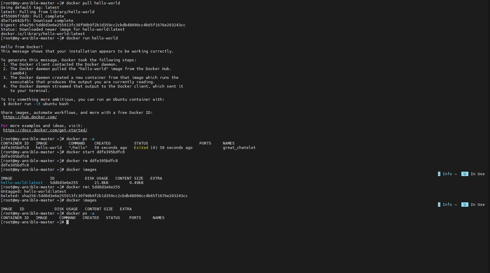

---

## 📋 Problem 2 — Interactive Container

- Run container `centos` or `ubuntu` in interactive mode
- Run `echo docker` inside the container
- Open a bash shell in the container and `touch` a file named `hello-docker`
- Stop the container and remove it
- Remove all stopped containers

```bash
docker pull ubuntu
docker run -it ubuntu
# inside the container:
echo docker
exit

docker ps -a

# start a fresh container and exec into it
docker run -it ubuntu
docker exec -it <container_id> bash
touch hello-docker
ls
exit

docker ps -a
docker rm -f <container_id>

# remove all stopped containers
docker rm -f <id1> <id2>
docker ps -a
```

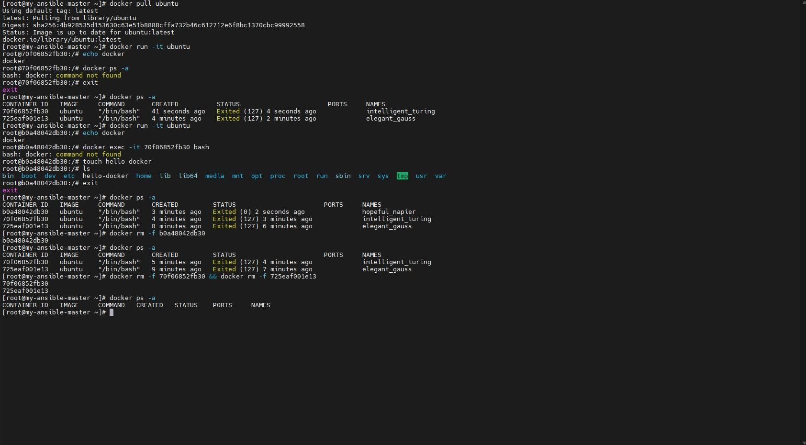

**Comment on `hello-docker`:** the file was created inside the container's writable layer via `touch`. It only exists as long as that container (or an image committed from it) exists — since the container was removed with `docker rm -f` without a volume or a `docker commit`, the file (and the container's entire filesystem layer) is gone for good. This is the core lesson of container ephemerality: anything written inside a container that isn't persisted via a volume, bind mount, or a committed image disappears when the container is removed.

---

## 📋 Problem 3 — MySQL with Environment Variables

Deploy a MySQL database called `app-database`, using the `mysql:latest` image, with `MYSQL_ROOT_PASSWORD` set to `P4sSw0rd0!` via `-e`, running in the background.

**Option A — direct `docker run`:**
```bash
docker run -d --name app-database -e MYSQL_ROOT_PASSWORD='P4sSw0rd0!' mysql:latest
docker ps -a
```

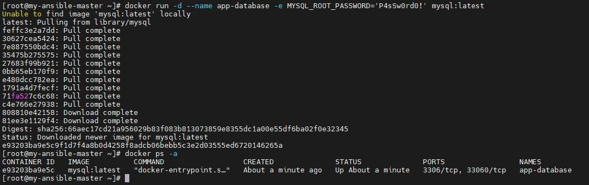

**Option B — via a Dockerfile:**
```dockerfile
FROM mysql:latest
ENV MYSQL_ROOT_PASSWORD=P4sSw0rd0!
```

```bash
mkdir docker
cd docker
vim Dockerfile
docker build -t my-mysql .
docker run -d --name app-database my-mysql
docker ps -a
```

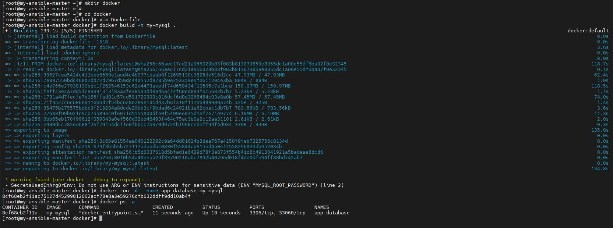
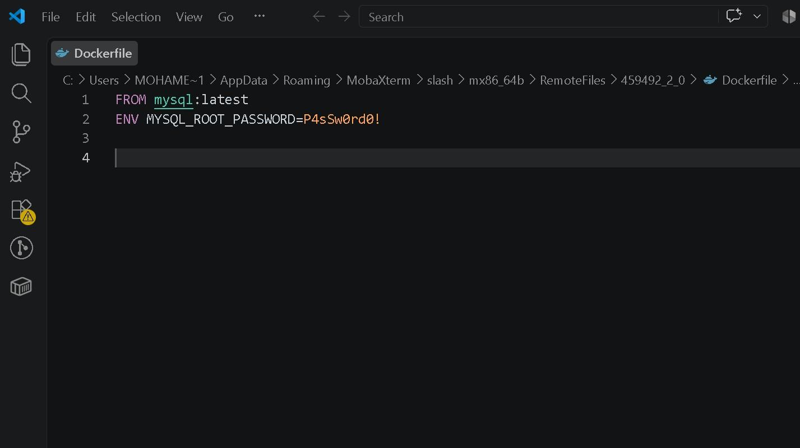

> ⚠️ Docker warns `SecretsUsedInArgOrEnv` for baking a password into `ENV` — fine for a lab, but in production use `docker secrets` or a `.env` file passed at runtime instead of hardcoding credentials into the image layer.

---

## 📋 Problem 4 — Nginx with Custom Content, Committed as a New Image

- Run the Nginx image
- Add HTML static files to the container and confirm they're accessible
- Commit the container as a new image named `IMAGE_NAME`

```bash
docker pull nginx
docker run -d --name my-nginx -p 8080:80 nginx

echo "<h1>Hello Docker</h1>" > index.html
docker cp index.html my-nginx:/usr/share/nginx/html/index.html

docker commit my-nginx IMAGE_NAME
# invalid reference format: repository name (library/IMAGE_NAME) must be lowercase
docker commit my-nginx new-nginx

docker images
```

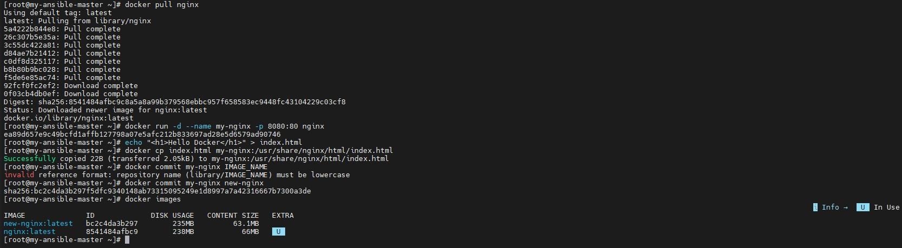

Visiting `http://<server-ip>:8080` in the browser confirms the content is being served:

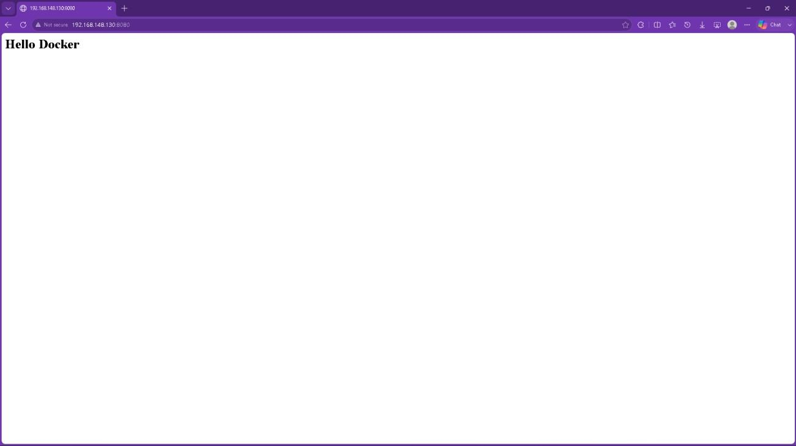

> **Note:** Docker image names must be lowercase — `docker commit my-nginx IMAGE_NAME` fails with `invalid reference format`, so the image was committed as `new-nginx` instead.

---

## 📋 Problem 5 — Containerize and Push a Python App

- Create a simple Python app
- Create a Dockerfile to containerize it
- Build the image and test it
- Push the image to Docker Hub

**`app.py`**
```python
print("Hello From Fadel")
```

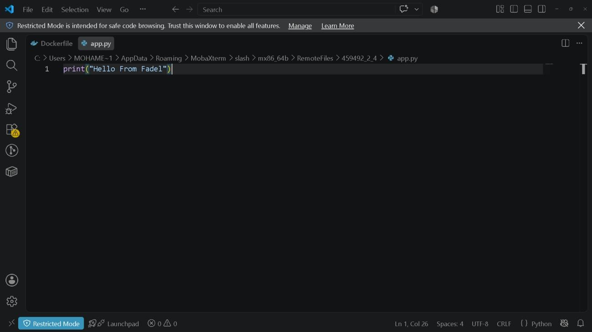

**`Dockerfile`**
```dockerfile
FROM alpine:latest
RUN apk add --update --no-cache python3 && ln -sf python3 /usr/bin/python && addgroup -S appgroup && adduser -S appuser -G appgroup
WORKDIR /app
USER appuser
COPY app.py .
ENTRYPOINT ["python", "app.py"]
```

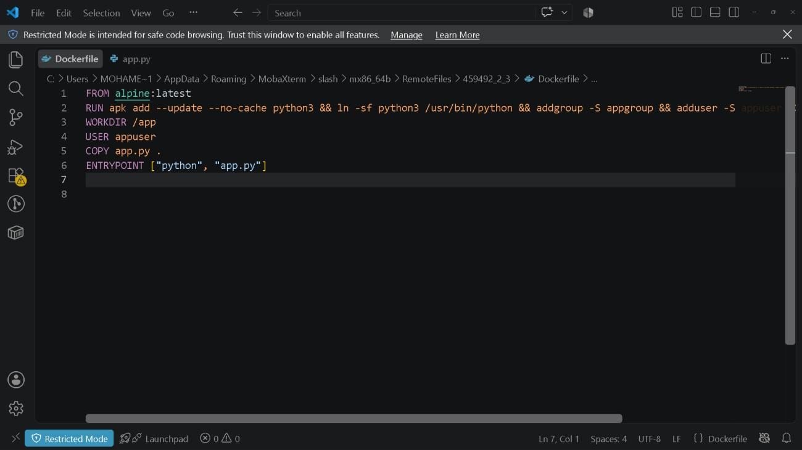

**Build, test, tag, and push:**
```bash
mkdir docker
cd docker
vim Dockerfile
docker build -t python:v1 .

docker run python:v1
# Hello From Fadel

docker images
docker tag python:v1 fadel8/repo_1:py-app-v1

docker login -u fadel8
docker push fadel8/repo_1:py-app-v1
```

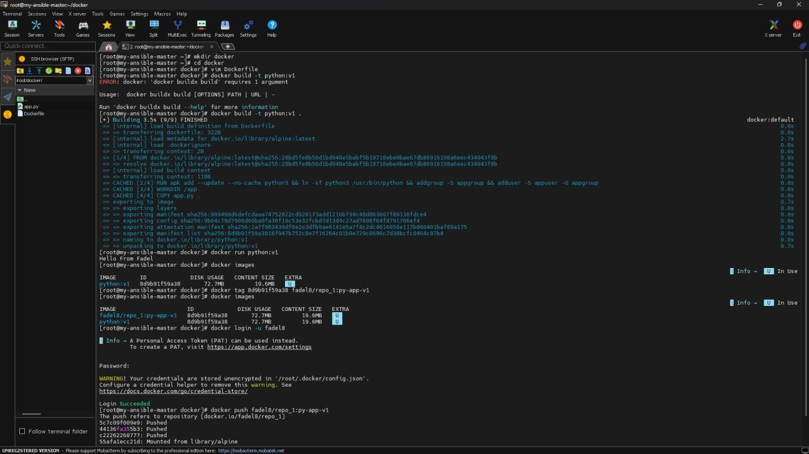

The pushed image is now visible in the [Docker Hub repository](https://hub.docker.com/repository/docker/fadel8/repo_1/general) under the tag `py-app-v1`:

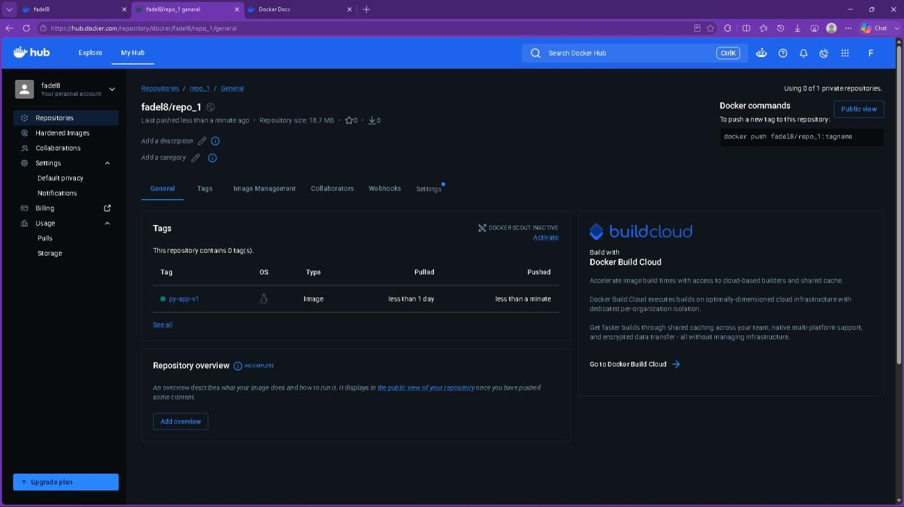

---

## 📂 Repository Structure

```
.
├── README.md
├── Dockerfile
├── app.py
└── images/
    ├── 01-problem1-hello-world.jpg
    ├── 02-problem2-ubuntu-container.jpg
    ├── 03-problem3-mysql-docker-run.jpg
    ├── 04-problem3-mysql-dockerfile-build.jpg
    ├── 05-problem3-mysql-dockerfile-source.jpg
    ├── 06-problem4-nginx-commands.jpg
    ├── 07-problem4-nginx-browser.jpg
    ├── 08-problem5-build-run-push.jpg
    ├── 09-problem5-dockerfile-source.jpg
    ├── 10-problem5-app-py-source.jpg
    └── 11-problem5-dockerhub-repo.jpg
```

---

## 🛠️ Tools & Technologies

- Docker CLI (`pull`, `run`, `ps`, `start`, `stop`, `rm`, `rmi`, `exec`, `cp`, `commit`, `build`, `tag`, `login`, `push`)
- Docker Hub (image registry)
- Alpine Linux (minimal base image for the Python app)
- MySQL and Nginx official images

---

## 📝 Notes

- Docker repository/image names must be all lowercase — capital letters (like `IMAGE_NAME`) will fail with `invalid reference format`.
- Baking secrets into a Dockerfile's `ENV` triggers a `SecretsUsedInArgOrEnv` warning; it's acceptable for a local lab but should be avoided in real deployments (use `--env-file`, Docker secrets, or a secrets manager instead).
- `docker commit` is useful for quick experiments but isn't a substitute for a proper Dockerfile — the Problem 5 image is built from a real Dockerfile so it's reproducible.
- The Python app runs as a non-root `appuser` inside the container (created via `addgroup`/`adduser` in the Dockerfile), following the principle of least privilege.
